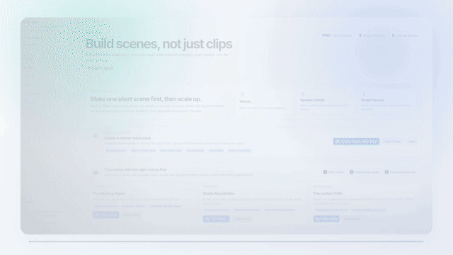
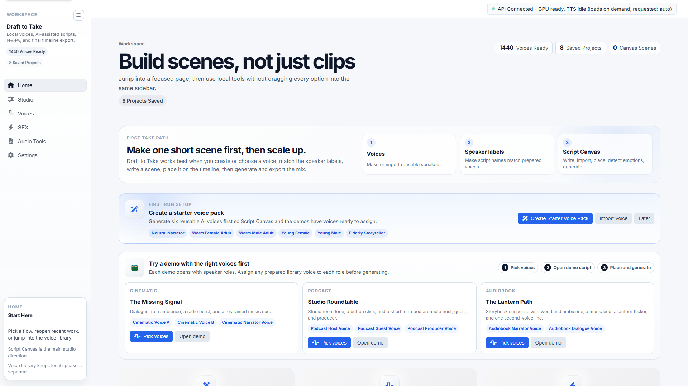
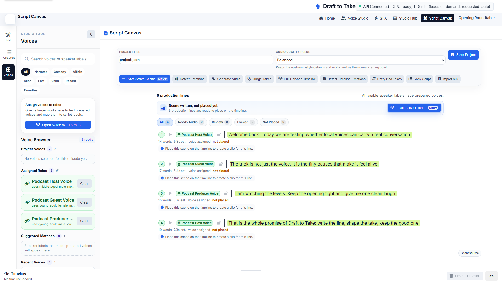
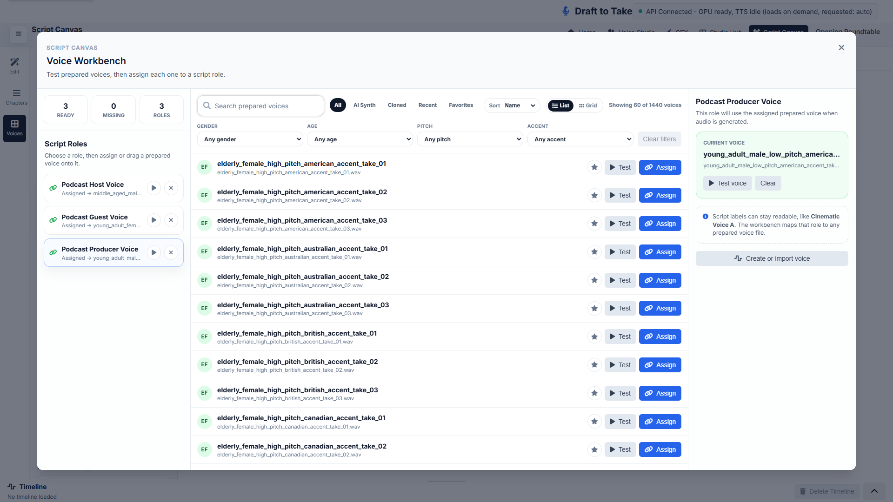
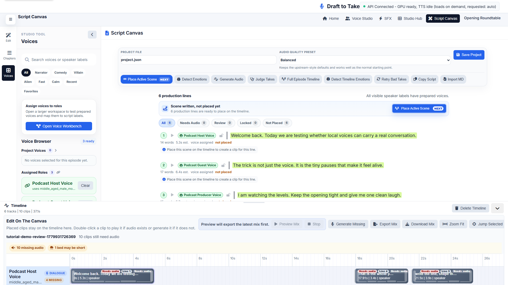
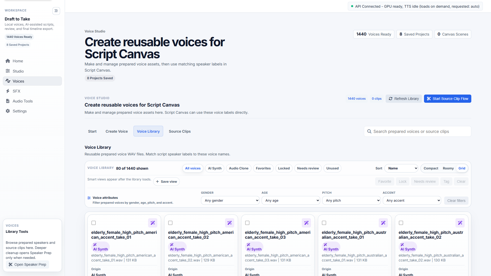

# Draft to Take Beta

**Local-first script-to-audio production studio.**

[](https://github.com/sponsors/JaySpiffy)
[](LICENSE)

Turn your scripts into finished multi-speaker audio, complete with emotion, sound design, and timeline mixing, all running locally on your machine.

**Think ElevenLabs-style script production, but Windows-local, IndexTTS2-powered, and built for creators who want control over voices, takes, emotion, SFX, ambience, music, and export.**

[Watch the 23-second app preview](media/draft-to-take-20s-app-clip.mp4)



Formerly **IndexTTS Workflow Studio**. This repository is the public beta home for Draft to Take, the next-generation version of the original prototype. Most Windows testers should start with the Docker launcher attached to the latest release; the native Windows installer is still experimental.

## The Workflow

Most TTS tools are great for one line at a time. Draft to Take is built for the whole production loop:

```text
Write or import a script -> assign prepared voices -> detect emotion -> generate takes -> lock the good ones -> add sound cues -> export the mix
```

Use it for audio drama, game dialogue, audiobook tests, YouTube narration, podcast sketches, horror scenes, or any project where you want a local script-to-audio workflow instead of a cloud text box.

This beta repo contains the Docker launcher, configuration, diagnostics scripts, tester docs, and an experimental Windows installer preview. It does not contain the private source code or model weights. The Docker launcher and installer both download supported model files into your own local machine.

Looking for the old prototype? The previous IndexTTS Workflow Studio code is preserved on the [`legacy-v2`](https://github.com/JaySpiffy/draft-to-take/tree/legacy-v2) branch and the [`v2-legacy-final`](https://github.com/JaySpiffy/draft-to-take/tree/v2-legacy-final) tag.

## Listen First

Short generated examples:

- [Script Canvas mini mix](media/audio-examples/script-canvas-mini-mix.mp3)
- [Emotion example: fear](media/audio-examples/emotion-fear.mp3)
- [Emotion example: anger + disgust](media/audio-examples/emotion-anger-disgust.mp3)

What you are hearing: audio generated through the Draft to Take workflow using local model-backed dialogue/emotion tooling. Output quality depends on your source voices, settings, model downloads, and hardware.

## Download And Start

### Option A: Docker Launcher Recommended

This is the recommended public beta path while the native installer is still being hardened.

1. Open the latest beta release: [Draft to Take v3.0.0 beta 14](https://github.com/JaySpiffy/draft-to-take/releases/tag/v3.0.0-beta.14).
2. Download `DraftToTake-Docker-Launcher-v3.0.0-beta.14.zip` from the assets.
3. Extract it somewhere simple, for example `C:\DraftToTakeBeta`.
4. Start Docker Desktop.
5. Double-click `start.bat`.
6. Open the URL printed in the terminal, usually:

```text
http://localhost:3000
```

First launch can be slow because Docker images and model files are large. Keep the terminal open and let it finish.

The launcher pulls these public images from GitHub Container Registry:

```text
ghcr.io/jayspiffy/draft-to-take-backend:v3.0.0-beta.10
ghcr.io/jayspiffy/draft-to-take-frontend:v3.0.0-beta.10
ghcr.io/jayspiffy/draft-to-take-script-llm:v3.0.0-beta.10
ghcr.io/jayspiffy/draft-to-take-omnivoice:v3.0.0-beta.10
ghcr.io/jayspiffy/draft-to-take-sfx:v3.0.0-beta.10
```

### Option B: Native Windows Installer Experimental

Use this only if you specifically want to test the dockerless installer preview. The Docker launcher above is currently more reliable for public testers.

1. Open [Draft to Take v3.0.0 beta 13](https://github.com/JaySpiffy/draft-to-take/releases/tag/v3.0.0-beta.13).
2. Download [`DraftToTake-Native-Setup-v3.0.0-beta.13.exe`](https://github.com/JaySpiffy/draft-to-take/releases/download/v3.0.0-beta.13/DraftToTake-Native-Setup-v3.0.0-beta.13.exe).
3. Run the installer and choose `Full Studio (recommended)`.
4. Start `Draft to Take` from the Start Menu.

The installer is unsigned during beta, so Windows may show a SmartScreen warning. It does not bundle model weights; the app downloads models into your local `%USERPROFILE%\DraftToTake\shared` folder.

Installer checksum:

```text
D61F6BDBF5770B8254F9D7349D93EB9D69974FC1771941F3428D2A048D257E8B
```

## Try This First

After starting the app, either use the in-app `Try Demo Project` flow or import the sample scene: [Blackmere Road](samples/try-this-first/blackmere-road-45s.md).

Suggested first run inside the app:

1. Use `Try Demo Project` and click `Pick voices`, or open `Voices` to prepare a reusable speaker first.
2. Assign each demo/script role to a prepared voice in the Voice Workbench.
3. Open the demo script, or go to `Studio -> Script Canvas` and import the sample Markdown file.
4. Click `Full Episode Timeline`.
5. Click `Detect Active Scene Emotions`.
6. Click `Generate Audio`.
7. Preview and download the mix.

The sample includes dialogue, IndexTTS2 emotion comments, ambience, music, and SFX markers so you can test the full canvas without inventing a script first.

## Why Creators Use It

- **Script-first workflow** - write scenes, chapters, pages, or speeches instead of isolated text snippets.
- **Local-first production** - scripts, voices, projects, and exports stay in your local shared folder unless you choose to share them.
- **Take review** - listen, lock strong takes, and regenerate only weak unlocked lines.
- **Emotion-aware delivery** - Qwen can suggest IndexTTS2 emotion vectors, and you can adjust them manually.
- **Timeline export** - dialogue, SFX, ambience, and music live in one embedded Script Canvas timeline.
- **Reusable libraries** - keep prepared voices, source clips, SFX, ambience, and music assets organized for future projects.

## Product Tour

### Home: start with the right next step



Home keeps the first path obvious: create or choose voices, assign readable script roles, open a demo, then place and generate the scene.

### Script Canvas: write, revise, cast, and generate



Script Canvas is the main workspace: draft or import scripts, assign prepared voices to readable speaker labels, detect emotions, clean up production lines, and send scenes to the embedded timeline.

### Voice Workbench: assign roles without renaming your script



The Voice Workbench lets you test prepared voices and map them to script roles such as narrator, host, guest, or any character name you wrote.

### Embedded Timeline: shape the finished take



Review timing, generate missing takes, balance dialogue/SFX/ambience/music tracks, lock good clips, preview the mix, and export without leaving Script Canvas.

### Voice Studio: prepare reusable voices



Create synthetic voices, prepare source clips, manage reusable voice assets, then assign them to readable Script Canvas role names in the Voice Workbench.

## Manuals

If you are testing the beta for the first time, start with the manuals:

- [Docs index](docs/README.md)
- [User Manual](docs/USER_MANUAL.md)
- [Tutorial Series](docs/tutorials/README.md)
- [Script Canvas Authoring Guide](docs/SCRIPT_CANVAS_AUTHORING_GUIDE.md)
- [Script Canvas AI System Prompt](docs/SCRIPT_CANVAS_AI_SYSTEM_PROMPT.md)
- [IndexTTS2 Prompting Guide](docs/INDEXTTS2_PROMPTING_GUIDE.md)
- [SFX, Ambience, And Music Smoke Test](docs/SFX_AMBIENCE_MUSIC_SMOKE_TEST.md)

## Beta Status

`v3.0.0-beta.14` is the latest public Docker launcher release. It uses the verified public `v3.0.0-beta.10` Docker image tag.

The native installer preview remains available on `v3.0.0-beta.13`, but it is experimental while startup and generation issues are being worked through.

All beta container images are public and pullable from GitHub Container Registry:

- `draft-to-take-backend`
- `draft-to-take-frontend`
- `draft-to-take-script-llm`
- `draft-to-take-omnivoice`
- `draft-to-take-sfx`

## Who This Beta Is For

This beta is best for people comfortable testing local AI tools on Windows. The Docker launcher is currently the recommended route; the installer path is unsigned and experimental.

Good testers:

- Run Windows 11.
- Have an NVIDIA GPU, ideally with 12-16 GB VRAM.
- Can tolerate large downloads and rough edges.
- Are willing to report bugs with hardware details and safe log excerpts.

## Requirements

- Windows 11 recommended.
- NVIDIA GPU strongly recommended.
- 32 GB system RAM recommended for the full workflow.
- 12-16 GB VRAM recommended for the smoother local AI path.
- Plenty of disk space. First-run model downloads can be many gigabytes.
- Docker Desktop with WSL2 and NVIDIA Container Toolkit for the recommended Docker launcher path.

CPU fallback can work for some paths, but it will be much slower.

## What The Experimental Windows Installer Does

The installer:

- Installs Draft to Take under your Windows user account.
- Creates Start Menu shortcuts for launch, model setup, diagnostics, stop, and data folder access.
- Uses the native Windows runtime path, so Docker Desktop is not required for the installer preview.
- Offers `Full Studio (recommended)`, `Core dialogue only`, and `Custom` setup choices.
- Downloads model packs after install or on first launch instead of bundling model weights in the setup file.
- Preserves `%USERPROFILE%\DraftToTake\shared` during updates and uninstall.

## What The Recommended Docker Launcher Does

The launcher:

- Creates `.env` from `.env.example` if needed.
- Creates a persistent shared folder under your Windows user profile.
- Checks whether Docker is running.
- Checks whether Docker can see your NVIDIA GPU.
- Pulls the prebuilt beta images.
- Starts the backend, frontend, Qwen sidecar, and OmniVoice sidecar.
- Starts the SFX/music sidecar automatically when Docker GPU support is available.
- Opens the local frontend URL after a successful start.

If the port values are blank in `.env`, the launcher tries nearby ports and prints the actual URLs. Keep them blank unless you need stable URLs.

## Where Your Files Go

Your data is stored outside this release folder:

```text
%USERPROFILE%\DraftToTake\shared
```

That means you can delete and re-download this beta repo without losing downloaded models, voices, projects, or exported audio.

Important folders:

- `shared\models` - downloaded model files.
- `shared\models\checkpoints` - IndexTTS2 checkpoints and Hugging Face cache.
- `shared\models\llm` - Qwen GGUF files.
- `shared\audio\speakers` - prepared speaker WAV files.
- `shared\audio\source_clips` - raw clips you want to prepare.
- `shared\audio\outputs` - exported mixes.
- `shared\audio\sfx` - generated or imported SFX assets.
- `shared\audio\music` - generated or imported music assets.
- `shared\data` - app/project data.

## Model Downloads

This beta does not bundle model weights. The Windows installer, Docker launcher, and containers download configured models into your local shared folder or Hugging Face cache.

The default Windows installer path uses IndexTTS2 for dialogue and can install Full Studio model packs for Qwen, OmniVoice, SFX, ambience, and music. The Docker launcher starts managed Qwen, OmniVoice, and SFX/music sidecars when supported. SFX, ambience, and music can still be disabled because those model-backed paths are heavier and license-dependent.

<details>
<summary>Show model details</summary>

| Feature area | Default model/source | Enabled by default | Where it is stored | Notes |
| --- | --- | --- | --- | --- |
| Dialogue TTS | `IndexTeam/IndexTTS-2` | Yes | `shared\models\checkpoints` | Main Script Canvas and timeline speech generation. The upstream bundle includes the IndexTTS2 checkpoints, tokenizer/BPE assets, emotion and speaker matrices, and related vocoder/runtime files used by IndexTTS2. |
| Script assistant and emotion detection | `ufoym/Qwen3-8B-Q4_K_M-GGUF` / `qwen3-8b-q4_k_m.gguf` | Yes | `shared\models\llm` | Managed llama.cpp sidecar used by the optional AI Thread and by Qwen emotion-vector detection. |
| Reusable voice design | `k2-fsa/OmniVoice` | Yes | Hugging Face cache under `shared\models\checkpoints\hf_cache` | Creates prepared voice WAVs for the Voice Studio. Final dialogue rendering still uses IndexTTS2. |
| SFX and ambience | `AEmotionStudio/woosh-models`, default model `Woosh-DFlow` | Yes when Docker GPU support is available | `shared\models\woosh` | SFX/music sidecar. `Woosh-Flow` can be selected as a slower quality option. |
| Music beds | `facebook/musicgen-small` | Yes when Docker GPU support is available | Hugging Face cache under `shared\models\checkpoints\hf_cache` | Music generation through the SFX/music sidecar. |
| Sound-cue alignment | `openai/whisper-tiny.en` | Lazy/optional | Hugging Face cache under `shared\models\checkpoints\hf_cache` | Used only when Whisper alignment is available and sound cue markers need word-timestamp alignment. |
| Speaker similarity checks | `speechbrain/spkrec-ecapa-voxceleb` and `funasr/campplus` / `campplus_cn_common.bin` | Lazy/optional | `shared\models\pretrained` and Hugging Face cache | Used for optional speaker similarity scoring and reranking during voice prep/quality checks. |
| Neural cleanup | DeepFilterNet via the `df` package | Lazy/optional | Docker cache volume / package cache | Used only when DeepFilterNet cleanup is selected or available through `auto` cleanup mode. Classic noise reduction can be used when it is unavailable. |

Most defaults can be changed in `.env`. The most useful model overrides are `INDTEXTS_MODEL_REPO`, `SCRIPT_LLM_MODEL_REPO_ID`, `SCRIPT_LLM_MODEL_FILENAME`, `OMNIVOICE_MODEL_ID`, `SFX_WOOSH_WEIGHTS_REPO`, `SFX_WOOSH_MODEL_NAME`, `MUSIC_MODEL_ID`, and `DRAFT_TO_TAKE_WHISPER_MODEL`.

</details>

## Docker Services Enabled By Default

The Docker launcher starts these services by default:

- Main Draft to Take backend.
- Frontend UI.
- Managed Qwen sidecar, used for emotion detection and the optional AI Thread.
- OmniVoice sidecar, used for beta testing reusable voice design.
- SFX/music sidecar, when Docker GPU support is available.

Qwen is enabled by default because emotion detection depends on it. You can turn off the AI Thread in the app settings if you do not want to use the experimental assistant workflow.

## SFX And Music

SFX/music generation is enabled by default when Docker can see an NVIDIA GPU. In the installer preview, Full Studio can download the related model packs, but the heavier native sound-design path is still a preview area. The current model-backed generators are experimental, heavier, and license-dependent, so you can still turn them off.

To disable SFX/music, edit `.env` and set:

```text
INDTEXTS_SFX_ENABLED=false
```

Then run `start.bat` again. If Docker GPU support is not available, `start.bat` leaves SFX/music disabled unless you explicitly opt in.

Only use SFX/music if your machine has enough VRAM and you understand that generated asset rights depend on the upstream model licenses and your use case.

## Updating The Beta

Installer users can update by downloading the newer setup `.exe` from the installer release and running it. Your shared folder under `%USERPROFILE%\DraftToTake\shared` is preserved.

Docker launcher users can update to a newer beta:

1. Run:

```text
stop.bat
```

2. Download the new beta repo ZIP or pull the latest repo.
3. Run:

```text
start.bat
```

Your shared folder under `%USERPROFILE%\DraftToTake\shared` is not deleted.

If a new release uses a new Docker image tag, check `.env` and update:

```text
DRAFT_TO_TAKE_IMAGE_TAG=v3.0.0-beta.10
```

## Stopping

Run:

```text
stop.bat
```

This stops containers but does not delete shared models, voices, projects, or outputs.

## Opening The App Or Shared Folder

If the containers are already running, use:

```text
open.bat
```

To open your persistent shared folder, use:

```text
open-shared-folder.bat
```

## Diagnostics

If something breaks, run:

```text
collect-diagnostics.bat
```

It writes a diagnostics text file under:

```text
%USERPROFILE%\DraftToTake\diagnostics
```

Review the file before posting it publicly. Do not share private scripts, voices, tokens, speaker samples, generated audio, or personal data unless you are comfortable doing so.

## Common Problems

### Windows SmartScreen Warning

The installer is unsigned during beta. Windows may warn that the app is from an unknown publisher. Check that the downloaded installer matches the SHA256 checksum on the release page.

### Installer First Start Looks Slow

This is expected on a fresh install. Runtime setup and model downloads can take a while, especially with `Full Studio (recommended)` selected. Keep the launch window open and let it finish.

### Docker Image Pull Failed

Make sure Docker Desktop is running and your network can reach GitHub Container Registry.

The images are public, so `docker login ghcr.io` should not be required for this beta.

### GPU Not Detected

The launcher will warn if Docker cannot see your NVIDIA GPU. Check Docker Desktop WSL2 integration and NVIDIA Container Toolkit support.

The app may continue in CPU mode, but generation will be much slower.

### Docker First Start Looks Slow

This is expected on a fresh install. Docker images and model files are large. Keep the terminal open and watch the logs before assuming it has crashed.

### Frontend URL Does Not Open

Check the terminal output. The launcher may choose another port if `3000` is busy, such as:

```text
http://localhost:3001
```

If the browser shows `Cannot GET /` on `localhost:3000`, check the `Docker frontend binding:` line printed by `start.bat`. If it is missing or points at a different port, run `collect-diagnostics.bat` and include the `Compose PS` section in the issue.

### Model Download Needs Authentication

Some upstream model downloads may require Hugging Face authentication depending on the model and account state.

If needed, edit `.env` and set:

```text
HF_TOKEN=your_token_here
```

Do not post your token in public issues or screenshots.

## Reporting Bugs

Use this repo's Issues tab.

Good bug reports include:

- Windows version.
- Whether you used the installer or Docker launcher.
- GPU model and VRAM.
- System RAM.
- Docker Desktop version, if using Docker.
- Whether Docker GPU support works, if using Docker.
- What you clicked.
- What you expected.
- What happened.
- A safe excerpt from the diagnostics file, if relevant.

Please do not upload private scripts, paid voices, private speaker samples, tokens, or sensitive generated audio to public issues.

## What To Test

Useful beta feedback includes:

- Installer setup, first launch, model download, and uninstall issues.
- First-run setup problems.
- Model download problems.
- Voice preparation and speaker library issues.
- Single-line generation quality.
- Script Canvas workflow confusion.
- Timeline/export bugs.
- VRAM pressure or sidecar crashes.
- Places where the app looks frozen but is actually working.

## Model And License Notes

The launcher, docs, and helper scripts in this repository are released under the [MIT License](LICENSE).

This beta does not sell, bundle, or grant rights to third-party model weights. The app may download models from official upstream sources into your local machine.

Draft to Take container images, private source code, third-party model weights, and generated model outputs are governed separately by their own terms.

Read:

- [BETA_TERMS.md](BETA_TERMS.md)
- [THIRD_PARTY_NOTICES.md](THIRD_PARTY_NOTICES.md)

SFX/music model-backed generation is experimental and license-dependent. It can be disabled with `INDTEXTS_SFX_ENABLED=false`.

## Privacy Note

Draft to Take is designed around a local-first workflow. Your scripts, speaker samples, generated audio, and projects stay in your local shared folder unless you choose to share them.

For beta support, only share the minimum logs and examples needed to reproduce a problem.
